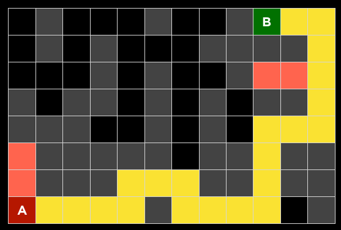
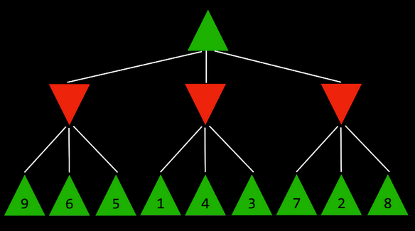

## Week 0 - Search: Quiz 0

### Question 1
**Between depth first search (DFS) and breadth first search (BFS), which will find a shorter path through a maze?**

   - [ ] DFS will always find a shorter path than BFS
   - [ ] BFS will always find a shorter path than DFS
   - [ ] DFS will sometimes, but not always, find a shorter path than BFS
   - [x] BFS will sometimes, but not always, find a shorter path than DFS
   - [ ] Both algorithms will always find paths of the same length

### Question 2

**Of the four search algorithms discussed in lecture — depth-first search, breadth-first search, greedy best-first search with Manhattan distance heuristic, and A\* search with Manhattan distance heuristic — which one (or multiple, if multiple are possible) could be the algorithm used?**
   - [ ] Could only be A*
   - [ ] Could only be greedy best-first search
   - [x] Could only be DFS
   - [ ] Could only be BFS
   - [ ] Could be either A* or greedy best-first search
   - [ ] Could be either DFS or BFS
   - [ ] Could be any of the four algorithms
   - [ ] Could not be any of the four algorithms

### Question 3

**Why is depth-limited minimax sometimes preferable to minimax without a depth limit?**

   - [x] Depth-limited minimax can arrive at a decision more quickly because it explores fewer states
   - [ ] Depth-limited minimax will achieve the same output as minimax without a depth limit, but can sometimes use less memory
   - [ ] Depth-limited minimax can make a more optimal decision by not exploring states known to be suboptimal
   - [ ] Depth-limited minimax is never preferable to minimax without a depth limit

### Question 4
**What is the value of the root node in the Minimax tree?**

   
   - [ ] 2
   - [ ] 3
   - [ ] 4
   - [x] 5
   - [ ] 6
   - [ ] 7
   - [ ] 8
   - [ ] 9

